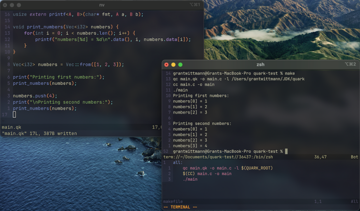

    

[Homepage](https://quar.k.vu) | [Quick Start](https://quar.k.vu/docs.html#quick-start) | [Standard Library](https://quar.k.vu/lib.html) | [Contributing](CONTRIBUTING.md)

> [!IMPORTANT]
> This langauge is in early stages of development, everything is subject to change, when building the compiler make
> sure to use the [latest release](https://github.com/quark-programming/quark/releases) You can see and submit issues
> on the repository's [issues page](https://github.com/quark-programming/quark/issues)

## Building the Compiler

Follow the [Quick Start Guide](https://quar.k.vu/docs.html#quick-start) to start programming in Quark!

### Other Repositories

- [quark-programming/quark-docs](https://github.com/quark-programming/quark-docs) - Documentation Website for the Quark
Programming Language
- [Angluca/quark.vim](https://github.com/Angluca/quark.vim) - Vim plugin for Quark language
- [Angluca/quark_template](https://github.com/Angluca/quark_template) - Project template for Quark-lang

### Projects / Examples
- [ephf/quark-web-server](https://github.com/ephf/quark-web-server) - A Web Server Implemented in Quark
- [Angluca/quark_raylib_template](https://github.com/Angluca/quark_raylib_template) - A template for using Quark with Raylib

## Contributing

See [CONTRIBUTING.md](CONTRIBUTING.md)
